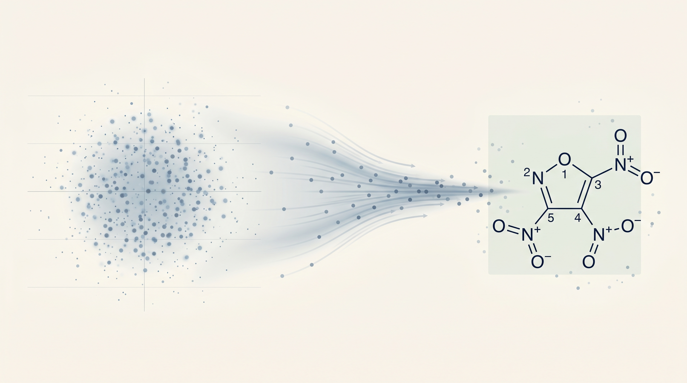

# DGLD4Energetic



**Domain-Gated Latent Diffusion for the Discovery of Novel Energetic Materials**

[paper PDF (TBD)] · [Zenodo DOI 10.5281/zenodo.19821953] · [BibTeX](#citation)

> 12 DFT-confirmed novel CHNO leads. Headline compound L1 (3,4,5-trinitro-1,2-isoxazole)
> at rho = 2.09 g/cm^3, D = 8.25 km/s, max-Tanimoto 0.27 to all 65,980 training molecules.
> Reproducible end-to-end on commodity hardware.

## What's in this repo

```
DGLD4Energetic/
  paper/         short_paper.html + figs/    Self-contained paper source.
  dgld/          LIMO + denoiser + score model + sampler (Python package).
  scripts/       Top-level entry points: train_*.py, sample.py, plot_fig*.py.
  data/          Small data committed; large data fetched via sidecars.
  models/        Sidecar pointers to Zenodo-hosted checkpoints.
  experiments/   One subfolder per paper experiment (T1 to T4 + DFT + baselines + ablations).
  figures/       Committed final PNG/SVG figures.
  docs/          Reproducibility guide, design notes, troubleshooting.
```

## Quick start: reproduce Figure 1 in 10 minutes

```bash
git clone https://github.com/ApartsinProjects/DGLD4Energetic.git
cd DGLD4Energetic
pip install -e .
bash scripts/download_assets.sh        # fetches large checkpoints + data from Zenodo
python scripts/plot_fig1.py            # writes figures/novelty_vs_D.png
```

## Reproducing every claim in the paper

| Paper claim                                  | Script                                              | Wall time | Hardware     |
|----------------------------------------------|-----------------------------------------------------|-----------|--------------|
| Fig 1: novelty vs detonation velocity        | `scripts/plot_fig1.py`                              | 1 min     | CPU          |
| Fig 19: lead cards                           | `scripts/plot_fig19.py`                             | 1 min     | CPU          |
| Fig 21: DFT dumbbell                         | `scripts/plot_fig21.py`                             | 1 min     | CPU          |
| Fig 22: baseline forest plot                 | `scripts/plot_fig22.py`                             | 1 min     | CPU          |
| Fig 23: quadrant scatter                     | `scripts/plot_fig23.py`                             | 1 min     | CPU          |
| T1: BDE audit on 12 leads                    | `experiments/t1_bde/`                               | TBD       | Modal A100   |
| T2: density audit                            | `experiments/t2_density/`                           | TBD       | Modal A100   |
| T3: denoiser seed variance                   | `experiments/t3_seed_variance/`                     | TBD       | Modal A100   |
| T4: oxatriazole anchor                       | `experiments/t4_oxatriazole/`                       | TBD       | Modal A100   |
| 12 DFT-confirmed leads + DNTF anchor         | `experiments/dft_audit/`                            | TBD       | Modal A100   |
| Pool fusion (m7)                             | `experiments/m7_pool_fusion/`                       | TBD       | Modal L4     |
| Multi-seed sampling (m6)                     | `experiments/multi_seed_sampling/`                  | TBD       | Modal L4     |
| CJ validation vs Cantera                     | `experiments/cj_validation/`                        | TBD       | CPU          |
| H50 sensitivity                              | `experiments/h50_sensitivity/`                      | TBD       | CPU          |
| FCD baselines                                | `experiments/baselines_distribution/`               | TBD       | CPU          |
| LSTM baseline                                | `experiments/baselines_lstm/`                       | TBD       | Modal L4     |
| REINVENT baseline                            | `experiments/baselines_reinvent/`                   | TBD       | Modal L4     |
| SELFIES-GA baseline                          | `experiments/baselines_selfies_ga/`                 | TBD       | Modal L4     |
| AiZynthFinder retrosynthesis                 | `experiments/aizynth_retro/`                        | TBD       | CPU          |
| Gaussian-control ablation                    | `experiments/gaussian_control/`                     | TBD       | Modal L4     |
| Tier-gate ablation                           | `experiments/tier_gate_ablation/`                   | TBD       | Modal L4     |

## Hosting

Large files on Zenodo (DOI 10.5281/zenodo.19821953); pointer files in `models/` and `data/`.
Each sidecar is a small text file with the canonical filename, size, SHA-256, and the Zenodo URL
to wget. See `models/*.sidecar` for the schema.

## Citation

```bibtex
@article{aperstein2026dgld,
  title   = {Domain-Gated Latent Diffusion for the Discovery of Novel Energetic Materials},
  author  = {Aperstein, Yehudit and Apartsin, Alexey},
  journal = {Nature Machine Intelligence},
  year    = {2026},
  doi     = {TBD},
  note    = {DOI 10.5281/zenodo.19821953 (companion repository).}
}
```

## License

- Code: Apache-2.0 (see `LICENSE`)
- Data + paper: CC-BY-4.0 (see `LICENSE-DATA`)
- Trained model checkpoints (Zenodo): CC-BY-4.0
